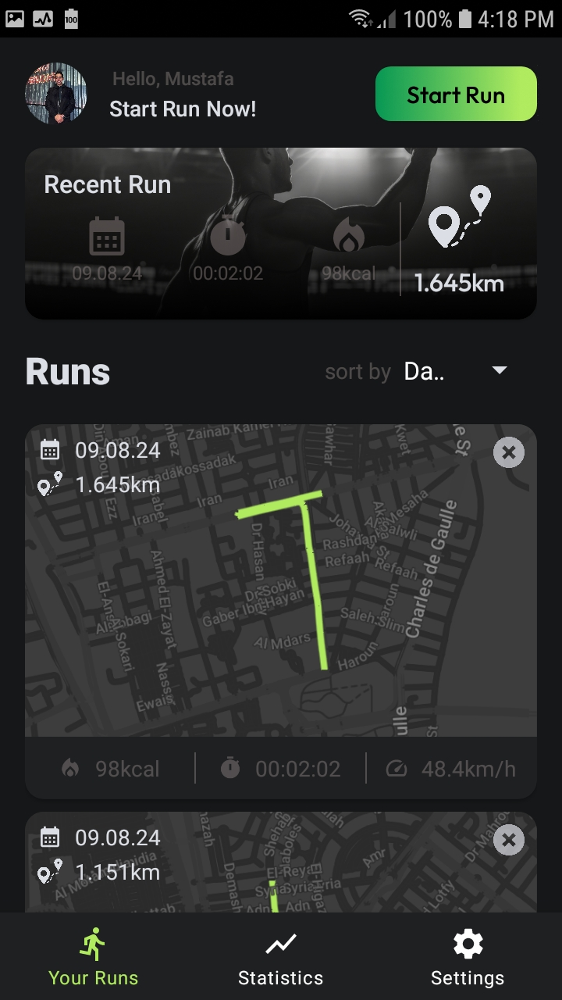
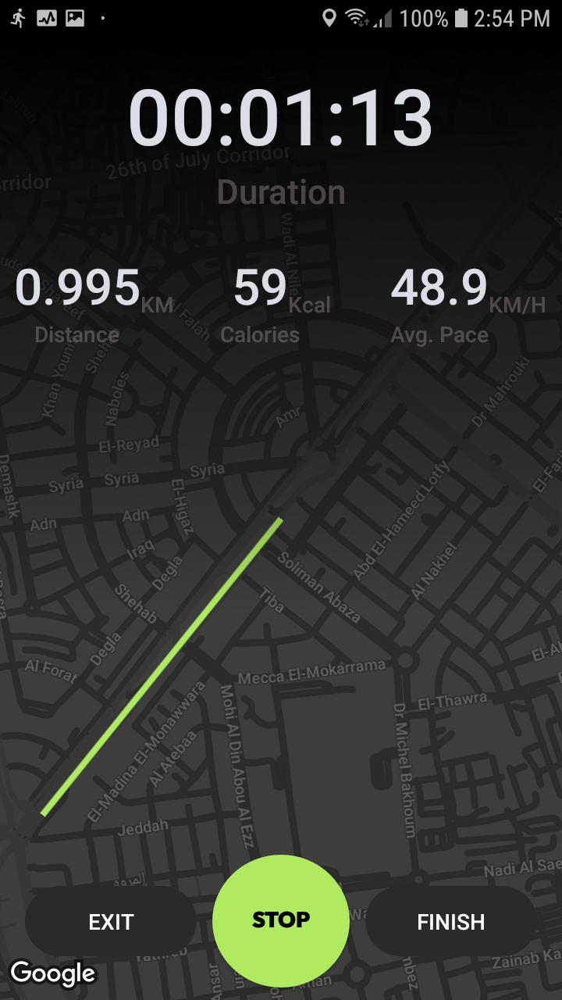
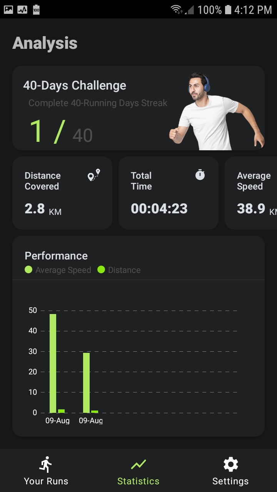
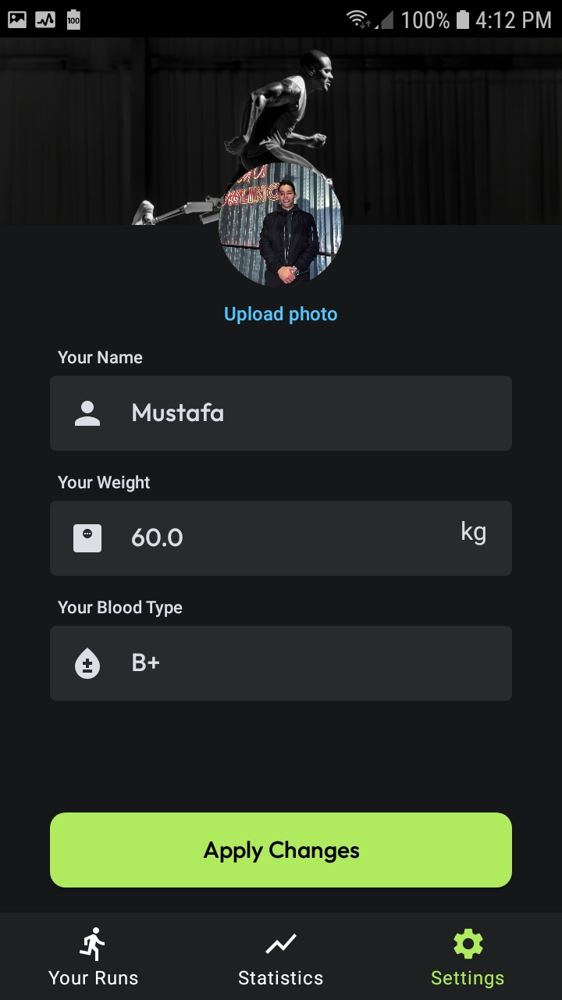

# RunningTrackerApp
A running tracker app that enables user to create run, track it, sort all runs he/she did, and show statistics on them. Implemented using MVVM, Room Db, Navigation component, and di with Dagger-Hilt.

# Project Title

Running Tracker Application

## Description

### A running tracker app that enables user to:
* Make a run and track it.
* Show all runs that user did.
* Sort runs by date, calories burned, average speed, duration, and distance.
* Show statistics of all runs followed by a bar chart.
* Update personal information: name, weight.

### Implemented using

* Room database.
* Dependency injection with Dagger-Hilt
* MVVM architecture
* Navigation Component
* Recyclerview

## Screens

  
   
  
  
  

 
